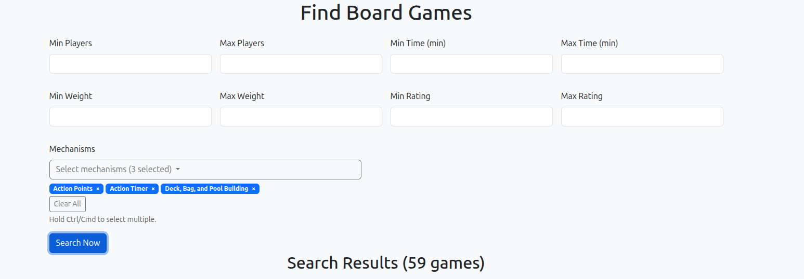
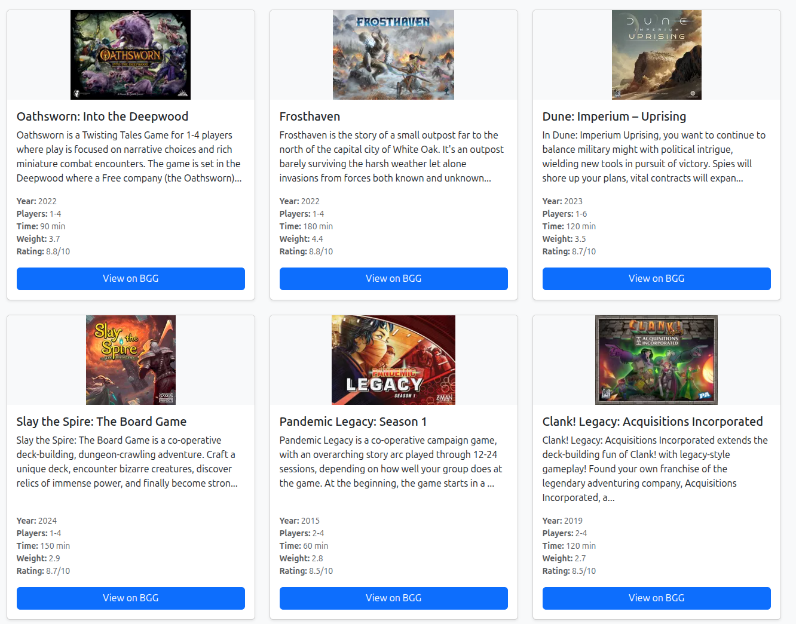

# Board Games Search App

A full-stack Django web application for discovering and filtering top-ranked board games from BoardGameGeek (BGG). Users can search the top 1000 ranked games using filters like player count, playtime, weight (complexity), rating, and game mechanics. Results are displayed in a responsive card layout with thumbnails and links to BGG.

This project showcases modern web development skills, from backend API integration and database management to dynamic frontend interactions without heavy JavaScript frameworks.

## Features
- **Local Data Ingestion**: Scrapes and caches the top 1000 BGG games (with details like ratings, mechanics) into a local database for fast, offline searches.
- **Advanced Filtering**: Real-time search with ranges for players, time, weight, and rating; multi-select mechanics via a custom dropdown.
- **Dynamic UI**: Live updates without page reloads using HTMX; Bootstrap for responsive design; custom JS for interactive badges.
- **Admin Interface**: Django admin for viewing/editing games and mechanics.
- **Error-Resilient**: Handles API quirks, rate limits, and frontend edge cases.

## Skills Demonstrated
This portfolio project highlights a range of full-stack and DevOps skills:

### Backend Development
- **Django Framework**: Built models (e.g., `Game` with M2M to `Mechanic`), views (ORM queries for filtering), forms (validation for ranges/multi-select), and URL routing.
- **Database Management**: Django ORM for migrations, querying (e.g., `filter(min_players__gte=...)`), and relationships; ingested ~1000 records with batch API calls.
- **API Integration & Scraping**: Used `requests` and `BeautifulSoup` to scrape BGG rankings; parsed XML API (`xml.etree.ElementTree`) for game details/mechanics; implemented rate limiting (`time.sleep`).
- **Management Commands**: Custom Django commands (`fetch_top_games`, `fetch_mechanics`) for one-time data population.

### Frontend Development
- **Responsive UI**: Bootstrap 5 for grids, cards, and components; custom CSS for thumbnails (object-fit, gradients) and hover effects.
- **Dynamic Interactions**: HTMX for AJAX-like search-as-you-type (no full reloads); custom vanilla JS for multi-select dropdown with badges and clear functionality.
- **Template Engine**: Django templates with loops, conditionals, and filters (e.g., `truncatechars`); partials for efficient updates.

### Development Tools & Best Practices
- **Environment Management**: Virtualenv (`venv`) for isolation; VS Code with `launch.json` for debugging commands (e.g., `runserver`, `fetch_top_games`).
- **Error Handling & Debugging**: Fixed issues like null selectors, pagination bugs, and template tags (``); used browser console and Django logs.
- **Static Assets**: Managed JS/CSS with Django static files; collected for production.
- **Performance**: Batched API calls (20 IDs/batch); ORM optimizations (`.distinct()` for M2M filters).

### Other Skills
- **Version Control**: Git-ready structure (e.g., `.gitignore` for `venv/`).
- **Testing & Iteration**: Rapid prototyping with incremental features (e.g., from basic table to card-based UI).
- **Documentation**: Inline comments, setup guides, and this README.

## Tech Stack
- **Backend**: Python 3.12, Django 5.x, SQLite (default; easy swap to PostgreSQL).
- **Frontend**: HTML5, Bootstrap 5, HTMX 1.9, Vanilla JS.
- **Libraries**: `requests`, `BeautifulSoup4`, `lxml` (parsing); Django contrib (admin, forms).
- **Tools**: VS Code, virtualenv.

## Setup & Installation
1. **Clone & Environment**: 
    * git clone [ boardgames_project](https://github.com/AdrianJonesTech/boardgames-search-app.git)
    * cd boardgames_project
    * python -m venv venv
    * source venv/bin/activate  # Windows: venv\Scripts\activate
    * pip install -r requirements.txt

2. **Django Setup**:
    * python manage.py makemigrations search
    * python manage.py migrate
    * python manage.py createsuperuser  # For admin access

3. **Data Ingestion** (run once; ~5-10 min):
    * python manage.py fetch_mechanics  # ~250 mechanics
    * python manage.py fetch_top_games  # Top 1000 games

4. **Run the App**:
    * python manage.py runserver

Visit `http://127.0.0.1:8000/` or `/admin/` for backend.

## Usage
- Fill filters (e.g., 2-4 players, min rating 7.0) and select mechanics (e.g., "Dice Rolling")—results update live.
- Click badges' × to remove; "Clear All" resets mechanics.
- Cards link to BGG for full details.

## Screenshots

## Popular Mechanics via BGG Forums

You can now scrape BGG forums/threads to find the most commonly mentioned mechanics and focus the UI on those.

Steps:
1. Ensure mechanics exist:
   - python manage.py fetch_mechanics
2. Scrape forum listing pages or specific threads (examples):
   - python manage.py scrape_forum_mechanics https://boardgamegeek.com/forum/1/boardgame --max-depth 1 --max-threads 100 --top-k 30
   - python manage.py scrape_forum_mechanics https://boardgamegeek.com/thread/123456 https://boardgamegeek.com/thread/789012 --top-k 25
   - python manage.py scrape_forum_mechanics "https://boardgamegeek.com/forums/search?searchTerm=mechanics" --max-depth 1 --max-threads 100 --top-k 30
   - Flags:
     - --max-threads: limit number of thread pages to visit total (default 200)
     - --max-depth: how far to follow pagination from listing pages (default 1)
     - --top-k: how many mechanics to flag as common (default 30)
     - --sleep: delay between HTTP requests in seconds (default 0.5)
3. After running, the app will:
   - Update Mechanic.mentions_count and flag the top-K as Mechanic.is_common=True.
   - Search form will automatically show only common mechanics if any are flagged; otherwise it falls back to all mechanics.
4. Admin tips:
   - In Django admin, view Mechanics to see mentions_count and toggle is_common if needed.

Notes and caveats:
- Scraping external sites can be brittle; adjust limits and be courteous with delays.
- Word-boundary, case-insensitive matching is used; multi-word mechanics are handled.
- Run the command periodically to refresh counts.

## Potential Improvements
- Pagination for results (e.g., Django's `Paginator`).
- Search by name/year via Elasticsearch.
- User auth for saved searches.
- Deployment: Docker + Heroku/AWS.

## License
MIT License—feel free to fork and adapt!

---

*Built by Adrian Jones | October 2025*

## Docker

Build the image:

- docker build -t boardgames:latest .

Run the container (SQLite DB inside the container):

- docker run -p 8000:8000 boardgames:latest
- Visit: http://localhost:8000

Persist your code and SQLite DB on the host (good for local dev):

- docker run -p 8000:8000 -v $(pwd):/app boardgames:latest
  - This mounts your project into the container so changes reflect live (restart may be needed). The app uses /app/db.sqlite3 by default, which will now live on your host.

Notes:
- Static files: The image now runs collectstatic at build time and uses WhiteNoise to serve static assets from /app/staticfiles.
- Hosts: Set allowed hosts via env when running in production, e.g.,
  - docker run -p 8000:8000 -e ALLOWED_HOSTS=example.com,www.example.com boardgames:latest
  - Behind a reverse proxy (Nginx/Traefik) you should set the appropriate hostnames and security headers.

## GitHub Container Registry (GHCR)

This repo includes a GitHub Actions workflow to build, tag, and publish the Docker image to GHCR on push and tags.

- Workflow: .github/workflows/ghcr-publish.yml
- Registry image: ghcr.io/<OWNER>/<REPO>

How it works:
- On pushes to main/master: publishes tags `latest`, branch name, and the commit SHA.
- On Git tags (e.g., v1.2.3): publishes semver-like tags from the ref and the SHA.
- Uses the repository GITHUB_TOKEN; no extra secrets required. Ensure Packages permissions are enabled for the workflow (set in the workflow file already).

First-time setup:
1. Ensure your repo is public or, if private, grant read access to consumers. For private repos, consumers need to authenticate to GHCR.
2. In your GitHub account/org settings, enable GitHub Packages/GHCR if not already enabled.

Manual run:
- Go to Actions tab → Build and Publish Docker image to GHCR → Run workflow.

Pulling the image:
- docker pull ghcr.io/<OWNER>/<REPO>:latest
- docker run -p 8000:8000 ghcr.io/<OWNER>/<REPO>:latest

If private, authenticate first:
- echo $CR_PAT | docker login ghcr.io -u <YOUR_GH_USERNAME> --password-stdin
  - Create a classic Personal Access Token with `read:packages` (and `write:packages` if you plan to push from local).

## Popular Mechanics (API-based, recommended)

If forum scraping is unreliable in your environment, you can compute “common mechanics” directly from the BGG XML API data you already ingest with `fetch_top_games`.

This approach considers a mechanic popular if it appears on many games. It avoids brittle, JS-rendered forum pages and anti-bot issues.

Steps:
1. Ensure mechanics and games exist:
   - python manage.py fetch_mechanics
   - python manage.py fetch_top_games
2. Compute common mechanics from game data:
   - python manage.py compute_common_mechanics --top-k 30 --min-count 1
   - Flags:
     - --top-k: how many mechanics to flag as common (default 30)
     - --min-count: minimum number of games that must reference the mechanic (default 1)
3. After running, the app will:
   - Update Mechanic.mentions_count to the number of games using each mechanic.
   - Flag the top-K as Mechanic.is_common=True.
   - The search form automatically shows only common mechanics if any are flagged; otherwise it falls back to all mechanics.

Notes:
- You can rerun this command anytime after refreshing game data.
- The existing `scrape_forum_mechanics` command remains available but is considered experimental due to the dynamic nature of BGG’s forum pages.
